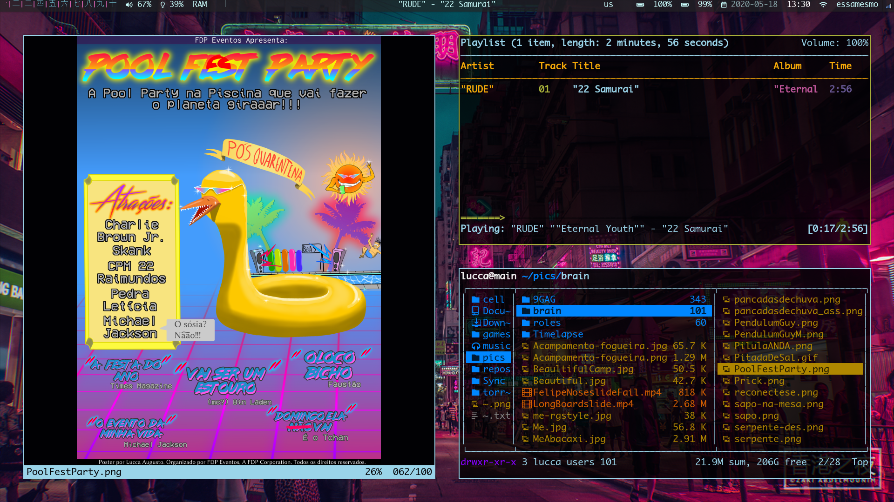
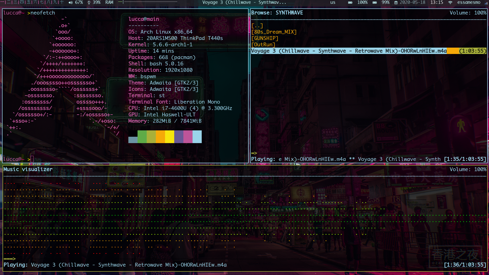

# RICE

My arch linux ricing.
+ Bspwm or DWM (i3 config files kept because why not)
+ Bspwm has better multimonitor support.
+ DWM is suckless, simple and effective, but i haven't messed with it enough to get nice multimonitor support.
+ ST
+ Polybar (Really looking for a new panel to make the change, haven't found it yet)
+ Sxhkd
+ mpd + ncmpcpp
+ bash (Maybe zsh in the future)

Using pywal for all the system colors. (should i change to gruvbox?)

## Key Bindings
On bspwm all key bindings are handled by sxhkd. On dwm window manager specific actions are bind in config.h and generic key bindings such as opening a program are bind in sxhkd.

As it is extremelly hard to manually change the file to load or not load the bindings for bspwm or dwm on sxhkdrc the startup_progs script does it automatically. On the sxhkd directory, under the config directory, there are separate files for each wm and a common file called base. On startup the startup_progs dinamically creates sxhkdrc by running cat on the base file and the bindings file for the currently running wm.

## Colors
On the colors subject a important thing must be said. Pywal generates a colors-wal-dwm.h file that doesn't work for dwm, causing compile time errors.
On my set_colors script there is a part in which a colors-wal-dwm-real.h is created by duplicating the original file and sedding it to make it right.
Changing system colors without running this script won't change dwm colors.
The new file is stored in the same directory (~/.cache/wal), be careful when cleaning the cache.

## progs.txt
This file is a list of all the main programs i use, really simplifies the process of installing this rice on another system.
I still have to manually insert a program in this list everytime i download a relevant one, but i guess that's the way since my computer won't now what programs are relevant for me. 
Keeping the full list of installed programs (pacman -Qsomethingsomething) was messy and left many undesired programs.

## ~/ config files
+ .bash_aliases
+ .bash_profile
+ .bashrc
+ .vimrc
+ .xinitrc
+ .Xresources
+ .vim/ (folder)
+ .vimgolf/ (folder)
+ .time/ (folder to save time spent on pc)

## .scripts folder
Personal scripts folder, useful for the whole system
<!--startscripts-->
### anote
Simple script for taking notes in the terminal.
Notes are saved in $NOTES_PATH directory or $HOME/.scripts if $NOTES_PATH is not set
run `anote -h` for help

### backup
Backup important directories to directory specified. 
 Exits if no directory was specified.
 Exits if the specified directory does not have space for backup
 run `backup` for help

### batsinal
Notifies via notify-send when battery is bellow 10%,
also beeps if $BEEP is defined and the script beep exists
if there is more than 1 battery, the total percentage is the 
average of the sum of the capacity of each battery

### batstatus
Echos to stdout the current capacity of each battery.
if util is passed as a argument, echoes the percent
of util capacity in relation to the original capacity.

### beep
Play a beep sound

### cheatsheet
Opens a terminal with a man document showing the 
important system bindings and some general info

### data_hora
Operations with date and time

### datelog
I have a cronjob run this every minute to log time spend on the computer in
`~/.time` for each day. Gives estimate of daily NEEThood.

### dmen
dmenu_run with pywal colors

### dwmbar
Simple bar script for DWM

### extract
A general, all-purpose extraction script.
Default behavior: Extract archive into new directory
Behavior with `-c` option: Extract contents into current directory

### faltam
Work script, notifies how long till i have worked my shift

### get_docs
Generates a MD file with all the doc comments from the files
in ~/.scripts folder

### keyboard_layout
Sets my keyboard layout to en_us and pt_br

### launch_polybar
Launches polybar. Works for multiple monitors

### listman
List manuals for the installed programs

### lockscreen
Locks the screen, pauses songs and videos.

### monitors
Helper for dealing with multiple monitors, works via dmenu

### mount_phone
Helper to mount android phones, works with dmenu

### mplayer
Starts mpd and opens ncmpcpp

### must_update
Warns me via notify-send when i should update (20 + packages needing update).

### powermenu
Shutdown or reboot via dmenu

### rec_webcam
Records my webcam

### reloadbar
kills current dwmbar so it reloads

### scratchpad
Scratchpad terminal for bspwm

### screencast
Records my screen to a file in ~/

### script_docs
Grabs the doc comments of all scripts in .scripts folder and output them in MD
to the README.md file in my rice repository.
doc comments are lines beggining with #-

### set_colors
Set my system colors using pywal

### shownotes
Show all untagged notes as a notification via notify-send

### showtime
Show how long i have been using the computer
-b argument show since when it`s counting

### sound_control
Wrapper for controlling volume, makes bluetooth and computer volume the same

### startup_progs
runs programs after wm is setup
avoids any errors that might occur if a program runs before another one
Example: if transmission-gtk runs before bspwm rules are set it will open on workspace 1

### syncrice
Sync my rice repository
if a string is passed as a argument uses this string as a commit message

### syncsuck
updates my Suckless repository
Generates diff files for the changes i made automatically

### syncthing
Runs syncthing

### syncwall
updates wallpapers

### ta_na_hora_de_brincar
Counts how long i have been working and notifies me via notify-send
when its almost over
Also notifies me if it`s getting close to the rush hour

### tecuida
Reminds me to take a break

### tibia
Launches tibia

### timer
Chess like timer
$1 is how long the first timer should run
$2 is how long the second timer should run

### toggle_redshift
Turns redshift on and off

### toggle_touchpad
Script to toggle the touchpad on/off

### treesize
Shows directories size in human readable format
<!--endscripts-->

## .config folter
the .config folder includes the following configurations
+ kritadisplayrc $RICE/.config
+ kritarc $RICE/.config
+ kritashortcutsrc $RICE/.config
+ wall.jpg $RICE/.config
+ i3 
+ i3status
+ bspwm
+ polybar
+ pulse
+ ranger
+ redshift
+ sxhkd
+ transmission
+ wal
+ mpd
+ ncmpcpp

## Scrots

