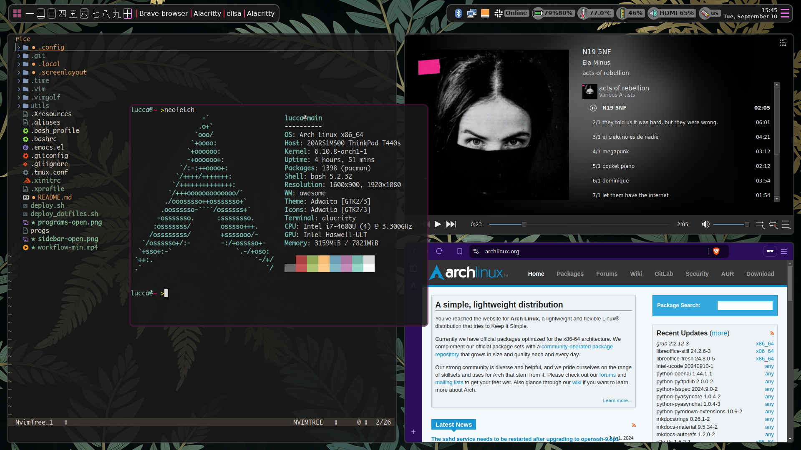

# RICE

The term RICE (Race Inspired Cosmetic Enhancement) comes from the car tuning world, meaning to mod the car with cosmetics that also enhance performance.
The term was adopted by the unix community and for my case i find it to be very true to it's original concept. I never had a good computer so i had to optimize
what i could to make my pcs last longer and run faster.

This setup is lean and efficient, allowing for fast and heavy use even with not so powefull pcs. It can be a bit more efficient by using a lighter wm.
It's been working perfectly fine for me for the past 7 years and i've had no problem whatsoever with any of the webdev projects i've worked on.
I run this on a Thinkpad T440s with 8GB of RAM and a 500GB SSD, but i do plan on upgrading my pc as it is starting to lag on some work tasks, specially GPU related stuff.

## Organization
This repo contains my dotfiles, with a . at the beggining of the file names. If you clone this and don't see shit, you gotta check the hidden files, i got confused with
this a bunch of times LOL. I do plan to reorganize the files so they live here without the . at the beggining, but not there yet.

### The main rice consists of:
#### WM
Using AwesomeWM, because 1. I like the way it handles multiple monitors, with 10 tags per monitor and i happen to be using 2 monitors these days.
BSPWM is also supported, and preferred, but i just miss having 10 workspaces per monitor. The reason i switched from BSPWM to Awesome is that one
of the programs i had to use for work would always instantiate a blank screen on BSPWM but worked fine on Awesome, and not having time to debug that, here I am.

I do plan on moving back to BSPWM or even try XMonad because i just find awesome annoying to configure. I used DWM for a while in the past but i just wanted something a bit
more practical that didn't involve patching. I3WM config files are here too, but i used it a looooong time ago, so don't expect it to work without some tweaking.

#### Launcher
Glorious [Rofi](https://github.com/davatorium/rofi) for launcher and dmenu like things. Also have a calculator setup with Rofi. See the [keybindings](.config/sxhkd) and [rofi configs](.config/rofi) for more info

#### Bars
Using glorious [Eww](https://github.com/elkowar/eww) for bars and widgets. I love it, easy to configure, many possibilities, looks great. Just use it.
I used to use Polybar but god it takes a looooong time to update and i just got sick of it's looks and modules. Config works 100% though.

#### Terminal
Alacritty or Kitty. Currently using Kitty for those sweet sweet images in the terminal.
Back in the day i used ST but it was lacking some features and i got annoyed with patching it.

#### KeyBindings
On BSPWM all key bindings are handled by sxhkd. On DWM and Awesome, window manager specific actions are bind in their config files and generic key bindings such as opening a program are bind in sxhkd.

On the sxhkd directory, under the config directory, there are separate files for each wm and a common file called base. On startup the startup_progs script dinamically creates sxhkdrc by running cat on the base file and the bindings file for the currently running wm.

## Colors
Still using pywal for all the system colors. I plan on changin to gruvbox, but shit works for me like this. Not very coherent throughout my system but fuck it i like the way it is today.

On the colors subject a important thing must be said. Pywal generates a colors-wal-dwm.h file that doesn't work for dwm, causing compile time errors.
On my set_colors script there is a part in which a colors-wal-dwm-real.h is created by duplicating the original file and sedding it to make it right.
Changing system colors without running this script won't change dwm colors.
The new file is stored in the same directory (~/.cache/wal), be careful when cleaning the cache.

## progs
This file is a list of all the main programs i use, really simplifies the process of installing this rice on another system.
I still have to manually insert a program in this list everytime i download a relevant one, but i guess that's the way since my computer won't now what programs are relevant for me.
Keeping the full list of installed programs (pacman -Qsomethingsomething) was messy and left many undesired programs.

## .local/bin folder
Personal scripts folder, useful for the whole system.
Documentation for these scripts can be found [here](.local/bin/README.md).

## Just a little taste

